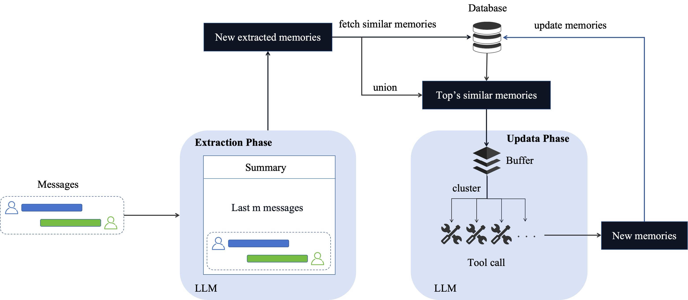

<div align="center">
  <h1>TeleMem</h1>
  <p>
      <a href="README.md">English</a> | <a href="README-ZH.md">简体中文</a>
  </p>
  <p>
      <a href="https://github.com/TeleAI-UAGI/Awesome-Agent-Memory"> Awesome-Agent-Memory →</strong></a>
  </p>
</div>

TeleMem is an advanced memory management system **fully compatible with Mem0**, deeply optimized for complex scenarios involving **multi-turn dialogues**, **character modeling**, **long-term information storage**, and **semantic retrieval**.

Through its unique **context-aware enhancement mechanism**, TeleMem provides conversational AI with core infrastructure offering **higher accuracy**, **faster performance**, and **stronger character memory capabilities**.

Building upon this foundation, TeleMem implements **video understanding, multimodal reasoning, and visual question answering** capabilities. Through a complete pipeline of video frame extraction, caption generation, and vector database construction, AI Agents can effortlessly **store, retrieve, and reason over video content** just like handling text memories.

📘 Overlay Mode Development Documentation: [TeleMem-Overlay.md](TeleMem-Overlay.md)

<div align="left">

**If you find this project helpful, please give us a ⭐️ on GitHub for the latest update.**

</div>

---

## 📦 Project Structure

```
telemem/
├── vendor/
│ └── mem0/                # Upstream repository source code
├── overlay/
│ └── patches/             # TeleMem custom patch files (.patch)
├── scripts/               # Overlay management scripts
│ ├── init_upstream.sh     # Initialize upstream subtree
│ ├── update_upstream.sh   # Sync upstream and reapply patches
│ ├── record_patch.sh      # Record local modifications as patches
│ └── apply_patches.sh     # Apply patches
├── PATCHES.md             # Patch list and descriptions
├── TeleMem-Overlay.md     # Overlay development guide (English)
├── TeleMem-Overlay-ZH.md  # Overlay development guide (Chinese)
├── README.md              # This file
├── README-ZH.md           # Chinese README
├── quickstart.py          # Quick start
└── quickstart_mm.py       # Quick start(Multimodel)
```

---

## 🔥 Research Highlights

* **Significantly improved memory accuracy**: Achieved **86.33%** accuracy on the ZH-4O Chinese multi-character long-dialogue benchmark, **19% higher** than Mem0.

* **Doubled speed performance**: Millisecond-level semantic retrieval enabled by efficient buffering and batch writing.

* **Greatly reduced token cost**: Optimized token usage delivers the same performance with significantly lower LLM overhead.

* **Precise character memory preservation**: Automatically builds independent memory profiles for each character, eliminating confusion.

* **Automated Video Processing Pipeline**: From raw video → frame extraction → caption generation → vector database, fully automated
  
* **ReAct-Style Video QA**: Multi-step reasoning + tool calling for precise video content understanding

## 📌 Table of Contents

* [Project Introduction](#project-introduction)

* [TeleMem vs Mem0: Core Advantages](#telemem-vs-mem0-core-advantages)

* [Experimental Results](#experimental-results)

* [Quick Start](#quick-start)

* [Core Features](#core-features)

* [Multimodal Memory Features](#multimodel-memory-features)
  
* [Storage Structure Explanation](#storage-structure-explanation)

* [Development and Contribution](#development-and-contribution)

* [Acknowledgements](#acknowledgements)

---

## Project Introduction

TeleMem enables conversational AI to maintain stable, natural, and continuous worldviews and character settings during long-term interactions through a deeply optimized pipeline of **character-aware summarization → semantic clustering deduplication → efficient storage → precise retrieval**.

### Features

- **Automatic memory extraction**: Extracts and structures key facts from dialogues.
- **Semantic clustering & deduplication**: Uses LLMs to semantically merge similar memories, reducing conflicts and improving consistency.
- **Character-profiled memory management**: Builds independent memory archives for each character in a dialogue, ensuring precise isolation and personalized management.
- **Efficient asynchronous writing**: Employs a buffer + batch-flush mechanism for high-performance, stable persistence.
- **Precise semantic retrieval**: Combines **FAISS + JSON dual storage** for fast recall and human-readable auditability.

### Applicable Scenarios

* Multi-character virtual agent systems
* Long-memory AI assistants (e.g., customer service, companionship, creative co-pilots)
* Complex narrative/world-building in virtual environments
* Dialogue scenarios with strong contextual dependencies
* Video content QA and reasoning
* Multimodal agent memory management
* Long video understanding and information retrieval
  
  

---

## TeleMem vs Mem0: Core Advantages

TeleMem deeply refactors Mem0 to address **characterization**, **long-term memory**, and **high performance**. Key differences:

| Capability Dimension       | Mem0                        | TeleMem                                                      |
| -------------------------- | --------------------------- | ------------------------------------------------------------ |
| Multi-character separation | ❌ Not supported             | ✅ Automatically creates **independent memory profiles** per character |
| Summary quality            | Basic summarization         | ✅ **Context-aware + character-focused prompts** covering key entities, actions, and timestamps |
| Deduplication mechanism    | Vector similarity filtering | ✅ **LLM-based semantic clustering**: merges similar memories via LLM |
| Write performance          | Streaming, single writes    | ✅ **Buffer + batch flush + concurrency**: 2–3× faster writes |
| Storage format             | SQLite / vector DB          | ✅ **FAISS + JSON metadata dual-write**: fast retrieval + human-readable |
| Multimodal Capability | Single image to text only | ✅ **Video Multimodal Memory**: Full video processing pipeline + ReAct multi-step reasoning QA |
---

## Experimental Results

### Dataset

We evaluate the ZH-4O Chinese long-character dialogue dataset constructed in the paper [MOOM: Maintenance, Organization and Optimization of Memory in Ultra-Long Role-Playing Dialogues](https://arxiv.org/abs/2509.11860):

- Average dialogue length: **600 turns per conversation**
- Scenarios: daily interactions, plot progression, evolving character relationships

Memory capability was assessed via QA benchmarks, e.g.:

```json
{
"question": "What is Zhao Qi's nickname for Bai Yulan? A Xiaobai B Xiaoyu C Lanlan D Yuyu",
"answer": "A"
},
{
"question": "What is the relationship between Zhao Qi and Bai Yulan? A Classmates B Teacher and student C Enemies D Neighbors",
"answer": "B"
}
```

### Experimental Configuration

* LLM: [Qwen3-8B](https://huggingface.co/Qwen/Qwen3-8B) (thinking mode disabled)
* Embedding model: [Qwen3-Embedding-8B](https://huggingface.co/Qwen/Qwen3-Embedding-8B)
* Metric: QA accuracy

* Baselines

  * RAG: All dialogue treated as knowledge base

  * Long context LLM: Full dialogue input into LLM context

  * [Memobase](https://github.com/memodb-io/memobase), [MOOM](https://github.com/cows21/MOOM-Roleplay-Dialogue), [A-mem](https://github.com/agiresearch/A-mem), [Mem0](https://github.com/mem0ai/mem0): Open-source memory systems
    
    | Method           | Overall(%) |
    |:---------------- |:---------- |
    | RAG              | 62.45      |
    | Memobase         | 76.78      |
    | MOOM             | 72.60      |
    | A-mem            | 73.78      |
    | Mem0             | 70.20      |
    | Long context LLM | 84.92      |
    | **TeleMem**      | **86.33**  |

---

## Quick Start

### Environment Preparation

```shell
# Create and activate virtual environment
conda create -n telemem python=3.10
conda activate telemem
# Install dependencies
pip install -r requirements.txt
```

### Apply Patches

```shell
# Run patch application script (see TeleMem-Overlay.md for details)
bash scripts/apply_patches.sh
# Configure model parameters (required)
vim vendor/TeleMem/config.yaml
```

### Example

```python
# quickstart.py
from vendor.TeleMem.TeleMemory import TeleMemory
from vendor.TeleMem.utils import load_config

# Load configuration and initialize memory system
config = load_config("vendor/TeleMem/config.yaml")
memory = TeleMemory.from_config(config)

# Simulate multi-turn dialogue data
messages = [
    {"role": "user", "content": "Jordan, did you take the subway to work again today?"},
    {"role": "assistant", "content": "Yes, James. The subway is much faster than driving. I leave at 7 o'clock and it's just not crowded."},
    {"role": "user", "content": "Jordan, I want to try taking the subway too. Can you tell me which station is closest?"},
    {"role": "assistant", "content": "Of course, James. You take Line 2 to Civic Center Station, exit from Exit A, and walk 5 minutes to the company."}
]

# Add conversation memory
memory.add(
    messages=messages,
    metadata={
        "sample_id": "session_001",
        "user": ["James", "Jordan"]
    }
)

# Retrieve relevant memories
query = "What transportation did Jordan use to go to work today?"
retrieved = memory.search(query=query, run_id="session_001", limit=3)

print("Retrieval results:")
print(retrieved)
```

---

## Core Features

### Add Memory (add)

The `add()` method injects one or more dialogue turns into the memory system.

```python
def add(
 self,
 messages,
 *,
 user_id: Optional[str] = None,
 agent_id: Optional[str] = None,
 run_id: Optional[str] = None,
 metadata: Optional[Dict[str, Any]] = None,
 infer: bool = True,
 memory_type: Optional[str] = None,
 prompt: Optional[str] = None,
)
```

#### 🔎  Parameter Description

| Parameter                         | Type                   | Required | Description                                                  |
| --------------------------------- | ---------------------- | -------- | ------------------------------------------------------------ |
| `messages`                        | `List[Dict[str, str]]` | ✅ Yes    | List of dialogue messages, each with `role` (`user`/`assistant`) and `content` |
| `metadata`                        | `Dict[str, Any]`       | ✅ Yes    | Must include: <br>・`sample_id`: unique session ID <br>・`user`: list of character names |
| `user_id` / `agent_id` / `run_id` | Optional[str]          | ❌ No     | Mem0-compatible parameters (ignored in TeleMem)              |
| `infer`                           | `bool`                 | ❌ No     | Whether to auto-generate memory summaries (default: `True`)  |
| `memory_type`                     | Optional[str]          | ❌ No     | Memory category (auto-classified if omitted)                 |
| `prompt`                          | Optional[str]          | ❌ No     | Custom prompt for summarization (uses optimized default if omitted) |

#### 🔁 Internal Workflow of `add()`

1. **Message preprocessing**: Merge consecutive messages from the same speaker; normalize turn structure.
2. **Multi-perspective summarization**:
   - Global event summary
   - Character 1’s perspective (actions, preferences, relationships)
   - Character 2’s perspective
3. **Vectorization & similarity search**: Generate embeddings and retrieve existing similar memories.
4. **Batch processing**: When buffer threshold is reached, invoke LLM to **semantically merge** similar memories.
5. **Persistence**: Dual-write to **FAISS (for retrieval)** and **JSON (for metadata)**.

---

### Search Memory (search)

Performs semantic vector-based retrieval of relevant memories with context-aware recall.

```python
def search(
 self,
 query: str,
 *,
 user_id: Optional[str] = None,
 agent_id: Optional[str] = None,
 run_id: Optional[str] = None,
 limit: int = 5,
 filters: Optional[Dict[str, Any]] = None,
 threshold: Optional[float] = None,
 rerank: bool = True,
)
```

#### 🔎 Parameter Description

| Parameter              | Type             | Required | Description                                       |
| ---------------------- | ---------------- | -------- | ------------------------------------------------- |
| `query`                | `str`            | ✅ Yes    | Natural language query                            |
| `run_id`               | `str`            | ✅ Yes    | Session ID (must match `sample_id` used in `add`) |
| `limit`                | `int`            | ❌ No     | Max number of results (default: 5)                |
| `threshold`            | `float`          | ❌ No     | Similarity threshold (0–1; auto-tuned if omitted) |
| `filters`              | `Dict[str, Any]` | ❌ No     | Custom filters (e.g., by character, time range)   |
| `rerank`               | `bool`           | ❌ No     | Whether to rerank results (default: `True`)       |
| `user_id` / `agent_id` | Optional[str]    | ❌ No     | Mem0-compatible (no effect in TeleMem)            |

> 🔍 Search is based on FAISS vector retrieval, supporting millisecond-level responses.

---

## Multimodal Memory Features

Beyond text memory, TeleMem further extends multimodal capabilities. Drawing inspiration from [Deep Video Discovery](https://github.com/microsoft/DeepVideoDiscovery)'s Agentic Search and Tool Use approach, we implemented two core methods in the TeleMemory class to support intelligent storage and semantic retrieval of video content.

| Method | Description |
|------|----------|
| `add_mm()` | Process video into retrievable memory (frame extraction → caption generation → vector database) |
| `search_mm()` | Query video content using natural language, supporting ReAct-style multi-step reasoning |

### Add Multimodal Memory (add_mm)

```python
def add_mm(
    self,
    video_path: str,
    *,
    frames_root: str = "video/frames",
    captions_root: str = "video/captions",
    vdb_root: str = "video/vdb",
    clip_secs: int = None,
    emb_dim: int = None,
    subtitle_path: str | None = None,
)
```

#### 🔎 Parameter Description

| Parameter | Type | Required | Description |
|--------|------|----------|------|
| video_path | str | ✅ Yes | Source video file path, e.g., `"video/3EQLFHRHpag.mp4"` |
| frames_root | str | ❌ No | Frame output root directory (default `"video/frames"`) |
| captions_root | str | ❌ No | Caption JSON output root directory (default `"video/captions"`) |
| vdb_root | str | ❌ No | Vector database output root directory (default `"video/vdb"`) |
| clip_secs | int | ❌ No | Seconds per clip, overrides config.CLIP_SECS |
| emb_dim | int | ❌ No | Embedding dimension, reads from config by default |
| subtitle_path | str | ❌ No | Subtitle file path (.srt), optional |

#### 🔁 add_mm() Internal Flow

1. **Frame Extraction**: `decode_video_to_frames` - Decodes video to JPEG frames at configured FPS
2. **Caption Generation**: `process_video` - Uses VLM (e.g., Qwen3-Omni) to generate detailed descriptions for each clip
3. **Vector Database Construction**: `init_single_video_db` - Generates embeddings for semantic retrieval

> 💡 **Smart Caching**: If the target file for a stage already exists, that stage is automatically skipped to save computational resources.

#### Return Value Example

```python
{
    "video_name": "3EQLFHRHpag",
    "frames_dir": "video/frames/3EQLFHRHpag/frames",
    "caption_json": "video/captions/3EQLFHRHpag/captions.json",
    "vdb_json": "video/vdb/3EQLFHRHpag/3EQLFHRHpag_vdb.json"
}
```

---

### Search Multimodal Memory (search_mm)

```python
def search_mm(
    self,
    question: str,
    video_db_path: str = "video/vdb/3EQLFHRHpag_vdb.json",
    video_caption_path: str = "video/captions/captions.json",
    max_iterations: int = 15,
)
```

#### 🔎 Parameter Description

| Parameter | Type | Required | Description |
|--------|------|----------|------|
| question | str | ✅ Yes | Question string (supports A/B/C/D multiple choice format) |
| video_db_path | str | ❌ No | Video vector database path |
| video_caption_path | str | ❌ No | Video caption JSON path |
| max_iterations | int | ❌ No | Maximum MMCoreAgent reasoning iterations (default 15) |

#### 🛠️ ReAct-Style Reasoning Tools

`search_mm` internally uses `MMCoreAgent`, employing a THINK → ACTION → OBSERVATION loop with three specialized tools:

| Tool Name | Function |
|--------|------|
| `global_browse_tool` | Get global overview of video events and themes |
| `clip_search_tool` | Search for specific content using semantic queries |
| `frame_inspect_tool` | Inspect frame details within a specific time range |

---

### Multimodal Example

Run the multimodal demo:

```bash
python quickstart_mm.py
```

Complete code example:

```python
from vendor.TeleMem.TeleMemory import TeleMemory
from vendor.TeleMem.utils import load_config
import os

# Initialize
config = load_config("vendor/TeleMem/config.yaml")
memory = TeleMemory.from_config(config)

# Define paths
video_path = "video/3EQLFHRHpag.mp4"
video_name = os.path.splitext(os.path.basename(video_path))[0]

# Step 1: Add video to memory (auto-processing)
if not os.path.exists(f"video/vdb/{video_name}/{video_name}_vdb.json"):
    result = memory.add_mm(
        video_path=video_path,
        frames_root="video/frames",
        captions_root="video/captions",
        vdb_root="video/vdb",
    )
    print(f"Video processing complete: {result}")

# Step 2: Query video content
question = """The problems people encounter in the video are caused by what?
(A) Catastrophic weather.
(B) Global warming.
(C) Financial crisis.
(D) Oil crisis.
"""

messages = memory.search_mm(
    question=question,
    video_db_path=f"vendor/TeleMem/video/vdb/{video_name}/{video_name}_vdb.json",
    video_caption_path=f"vendor/TeleMem/video/captions/{video_name}/captions.json",
    max_iterations=15,
)

# Extract final answer
from core import extract_choice_from_msg
answer = extract_choice_from_msg(messages)
print(f"Answer: ({answer})")
```

---


## Storage Structure Explanation

### Text Memory Storage

TeleMem automatically creates a structured storage layout under `./faiss_db/`, organized by session and character:

```
faiss_db/
├── session_001_events.index
├── session_001_events_meta.json 
├── session_001_person_1.index 
├── session_001_person_1_meta.json 
├── session_001_person_2.index 
└── session_001_person_2_meta.json 
```

### 📄 Metadata Example (_meta.json)

```json
{
 "summary": "Characters discussed the upcoming action plan.",
 "sample_id": "session_001",
 "round_index": 3,
 "timestamp": "2024-01-01T00:00:00Z",
 "user": "Jordan" // Only present in person_*.json
}
```

> All memories include summary, round number, timestamp, and character, facilitating auditing and debugging.

------

### Multimodal Memory Storage

TeleMem generates video-related storage files in the `./video/` directory:

```
video/
├── frames/
│   └── <video_name>/
│       └── frames/
│           ├── frame_000001_n0.00.jpg
│           ├── frame_000002_n0.50.jpg
│           └── ...
├── captions/
│   └── <video_name>/
│       ├── captions.json          # Clip descriptions + subject registry
│       └── ckpt/                  # Checkpoint for resume
│           ├── 0_10.json
│           └── 10_20.json
└── vdb/
    └── <video_name>/
        └── <video_name>_vdb.json  # Semantic retrieval vector database
```

#### 📄 captions.json Structure

```json
{
    "0_10": {
        "caption": "The narrator discusses climate data, showing melting glaciers..."
    },
    "10_20": {
        "caption": "Scene shifts to coastal communities affected by rising sea levels..."
    },
    "subject_registry": {
        "narrator": {
            "name": "narrator",
            "appearance": ["professional attire"],
            "identity": ["climate scientist"],
            "first_seen": "00:00:00"
        }
    }
}
```

------


## Development and Contribution

* Patch management process: Refer to [TeleMem-Overlay.md](TeleMem-Overlay.md)
* Chinese documentation: [README-ZH.md](README-ZH.md)

---
## License

[Apache 2.0 License](LICENSE)

---
## Acknowledgements

TeleMem’s development has been deeply inspired by open-source communities and cutting-edge research. We extend our sincere gratitude to the following projects and teams:

- [**Mem0**](https://github.com/mem0ai/mem0)
- [**Memobase**](https://github.com/memodb-io/memobase)
- [**MOOM**](https://github.com/cows21/MOOM-Roleplay-Dialogue)
- [**DVD**](https://github.com/microsoft/DeepVideoDiscovery)
- [**Memento**](https://github.com/Agent-on-the-Fly/Memento)
  
------

<div align="center">

**If you find this project helpful, please give us a ⭐️.**

Made with ❤️ by the Ubiquitous AGI team at TeleAI.

</div>

<div align="center" style="margin-top: 10px;">
  
  &nbsp;&nbsp;&nbsp;
  
</div>

