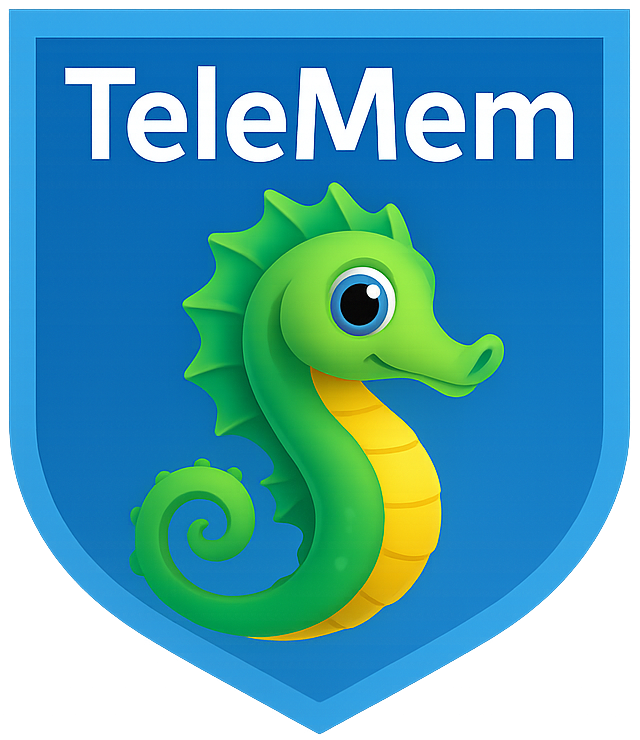
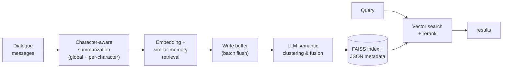
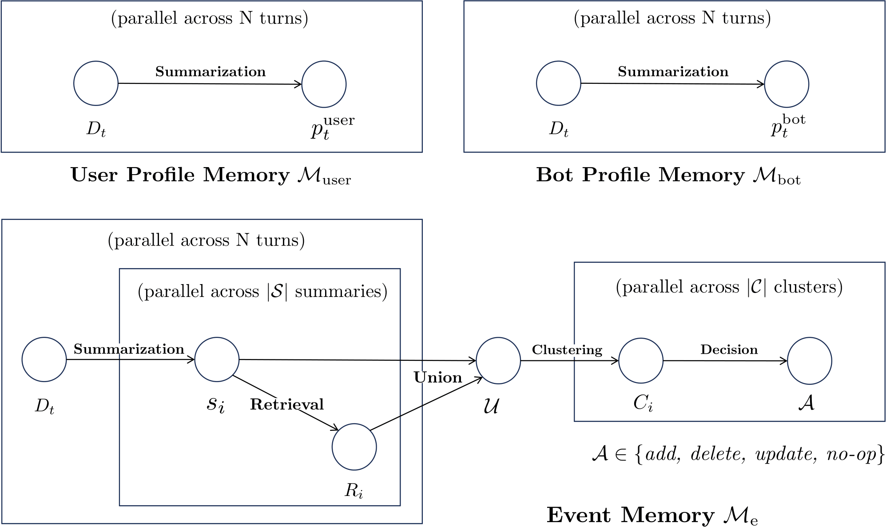

<p align="center">
  <a href="https://github.com/TeleAI-UAGI/telemem">
    
  </a>
</p>

<h1 align="center"> TeleMem: Building Long-Term and Multimodal Memory for Agentic AI </h1>

<p align="center">
  <a href="https://arxiv.org/abs/2601.06037">
    
  </a>
  <a href="https://github.com/TeleAI-UAGI/telemem/actions/workflows/ci.yml">
    
  </a>
  <a href="https://pypi.org/project/telemem/">
    
  </a>
  <a href="https://github.com/TeleAI-UAGI/telemem">
    
  </a>
  <a href="https://github.com/TeleAI-UAGI/TeleMem/blob/main/LICENSE">
    
  </a>
  
  
</p>

<div align="center">
  
**If you find this project helpful, please give us a ⭐️ on GitHub for the latest update.**

_🤝 Contributions welcome! Feel free to open an issue or submit a pull request._

</div>

---

<div align="center">
  <p>
      <a href="README.md">English</a> | <a href="README-ZH.md">简体中文</a>
  </p>
  <p>
      <a href="https://github.com/TeleAI-UAGI/Awesome-Agent-Memory"> <strong>📄 Awesome-Agent-Memory →</strong></a>
  </p>
</div>

TeleMem is an agent memory management layer that can be used as <mark>**a high-performance drop-in replacement for [Mem0](https://mem0.ai/)** with one line of code (`import telemem as mem0`)</mark>, deeply optimized for complex scenarios involving **multi-turn dialogues**, **character modeling**, **long-term information storage**, and **semantic retrieval**.

Through its unique **context-aware enhancement mechanism**, TeleMem provides conversational AI with core infrastructure offering **higher accuracy**, **faster performance**, and **stronger character memory capabilities**.

Building upon this foundation, TeleMem implements **video understanding, multimodal reasoning, and visual question answering** capabilities. Through a complete pipeline of video frame extraction, caption generation, and vector database construction, AI Agents can effortlessly **store, retrieve, and reason over video content** just like handling text memories.

The ultimate goal of the TeleMem project is to _use an agent's hindsight to improve its foresight_. 

**TeleMem, where memory lives on and intelligence grows strong.**

### Why TeleMem?

- 🎭 **Character memory done right** — the only open-source memory layer that automatically builds **isolated, per-character memory profiles**, built for role-play, companion AI, NPCs, and multi-persona assistants.
- 🎬 **Memory for video, not just text** — a full video → frames → captions → vector DB pipeline with **ReAct-style multi-step video QA**.
- 🏠 **Fully local by default** — runs end-to-end on your hardware (Qwen + FAISS); no cloud service, no paid tier, no data leaving your machine.
- 🔌 **mem0-compatible API** — `add()` / `search()` accept the same arguments and return the same `{"results": [...]}` shapes, so existing Mem0 code keeps working.

---

## 📢 Latest Updates
- **[2026-06-12] 🎉 TeleMem is now on PyPI: `pip install telemem`! [v1.6.0](https://github.com/TeleAI-UAGI/telemem/releases/tag/v1.6.0) adds Ollama/DeepSeek/Kimi configs, LangChain & LlamaIndex examples, and a [documentation site](https://teleai-uagi.github.io/telemem/).**
- **[2026-06-12] 🎉 TeleMem [v1.5.0](https://github.com/TeleAI-UAGI/telemem/releases/tag/v1.5.0) has been released: true mem0 drop-in API, lightweight core install, and CI!**
- **[2026-06-11] 🎉 TeleMem [v1.4.0](https://github.com/TeleAI-UAGI/telemem/releases/tag/v1.4.0) has been released with [MCP support](docs/MCP.md)!**
- **[2026-01-28] 🎉 TeleMem [v1.3.0](https://github.com/TeleAI-UAGI/telemem/releases/tag/v1.3.0) has been released!**
- **[2026-01-22] 🎉 TeleMem [Tech Report](https://arxiv.org/abs/2601.06037) has been updated to its 4th version!**
- **[2026-01-13] 🎉 TeleMem [Tech Report](https://arxiv.org/abs/2601.06037) has been released on arXiv!**
- **[2026-01-09] 🎉 TeleMem [v1.2.0](https://github.com/TeleAI-UAGI/telemem/releases/tag/v1.2.0) has been released!**
- **[2025-12-31] 🎉 TeleMem [v1.1.0](https://github.com/TeleAI-UAGI/telemem/releases/tag/v1.1.0) has been released!**
- **[2025-12-05] 🎉 TeleMem [v1.0.0](https://github.com/TeleAI-UAGI/telemem/releases/tag/v1.0.0) has been released!**

---

## 🔥 Research Highlights

* **Significantly improved memory accuracy**: Achieved **86.33%** accuracy on the ZH-4O Chinese multi-character long-dialogue benchmark, **19% higher** than Mem0.
* **Doubled speed performance**: Millisecond-level semantic retrieval enabled by efficient buffering and batch writing.
* **Greatly reduced token cost**: Optimized token usage delivers the same performance with significantly lower LLM overhead.
* **Precise character memory preservation**: Automatically builds independent memory profiles for each character, eliminating confusion.
* **Automated Video Processing Pipeline**: From raw video → frame extraction → caption generation → vector database, fully automated
* **ReAct-Style Video QA**: Multi-step reasoning + tool calling for precise video content understanding

---

## 📌 Table of Contents

* [Project Introduction](#project-introduction)
* [TeleMem vs Mem0: Core Advantages](#telemem-vs-mem0-core-advantages)
* [Experimental Results](#experimental-results)
* [Quick Start](#quick-start)
* [Project Structure](#project-structure)
* [Core Functions](#core-functions)
* [Multimodal Extensions](#multimodal-extensions)
* [MCP Server](#mcp-server)
* [Framework Integrations](#framework-integrations)
* [Data Storage Explanation](#data-storage)
* [Development and Contribution](#development-and-contribution)
* [Acknowledgements](#acknowledgements)

---

## Project Introduction

TeleMem enables conversational AI to maintain stable, natural, and continuous worldviews and character settings during long-term interactions through a deeply optimized pipeline of **character-aware summarization → semantic clustering deduplication → efficient storage → precise retrieval**.



### Features

- **Automatic memory extraction**: Extracts and structures key facts from dialogues.
- **Semantic clustering & deduplication**: Uses LLMs to semantically merge similar memories, reducing conflicts and improving consistency.
- **Character-profiled memory management**: Builds independent memory archives for each character in a dialogue, ensuring precise isolation and personalized management.
- **Efficient asynchronous writing**: Employs a buffer + batch-flush mechanism for high-performance, stable persistence.
- **Precise semantic retrieval**: Combines **FAISS + JSON dual storage** for fast recall and human-readable auditability.

### Applicable Scenarios

* Multi-character virtual agent systems
* Long-memory AI assistants (e.g., customer service, companionship, creative co-pilots)
* Complex narrative/world-building in virtual environments
* Dialogue scenarios with strong contextual dependencies
* Video content QA and reasoning
* Multimodal agent memory management
* Long video understanding and information retrieval
  
  

---

## TeleMem vs Mem0: Core Advantages

TeleMem deeply refactors Mem0 to address **characterization**, **long-term memory**, and **high performance**. Key differences:

| Capability Dimension       | Mem0                        | TeleMem                                                      |
| -------------------------- | --------------------------- | ------------------------------------------------------------ |
| Multi-character separation | ❌ Not supported             | ✅ Automatically creates **independent memory profiles** per character |
| Summary quality            | Basic summarization         | ✅ **Context-aware + character-focused prompts** covering key entities, actions, and timestamps |
| Deduplication mechanism    | Vector similarity filtering | ✅ **LLM-based semantic clustering**: merges similar memories via LLM |
| Write performance          | Streaming, single writes    | ✅ **Batch flush + concurrency**: 2–3× faster writes |
| Storage format             | SQLite / vector DB          | ✅ **FAISS + JSON metadata dual-write**: fast retrieval + human-readable |
| Multimodal Capability | Single image to text only | ✅ **Video Multimodal Memory**: Full video processing pipeline + ReAct multi-step reasoning QA |
---

## Experimental Results

### Dataset

We evaluate the ZH-4O Chinese long-character dialogue dataset constructed in the paper [MOOM: Maintenance, Organization and Optimization of Memory in Ultra-Long Role-Playing Dialogues](https://arxiv.org/abs/2509.11860):

- Average dialogue length: **600 turns per conversation**
- Scenarios: daily interactions, plot progression, evolving character relationships

Memory capability was assessed via QA benchmarks, e.g.:

```json
{
"question": "What is Zhao Qi's nickname for Bai Yulan? A Xiaobai B Xiaoyu C Lanlan D Yuyu",
"answer": "A"
},
{
"question": "What is the relationship between Zhao Qi and Bai Yulan? A Classmates B Teacher and student C Enemies D Neighbors",
"answer": "B"
}
```

### Experimental Configuration

- LLM: [Qwen3-8B](https://huggingface.co/Qwen/Qwen3-8B) (thinking mode disabled)
- Embedding model: [Qwen3-Embedding-8B](https://huggingface.co/Qwen/Qwen3-Embedding-8B)
- Metric: QA accuracy

    | Method                                                    | Overall(%) |
    |:--------------------------------------------------------- |:---------- |
    | RAG                                                       | 62.45      |
    | _[Mem0](https://github.com/mem0ai/mem0)_                    | _70.20_      |
    | [MOOM](https://github.com/cows21/MOOM-Roleplay-Dialogue)  | 72.60      |
    | [A-mem](https://github.com/agiresearch/A-mem)             | 73.78      |
    | [Memobase](https://github.com/memodb-io/memobase)         | 76.78      |
    | **[TeleMem](https://github.com/TeleAI-UAGI/TeleMem)**     | **86.33**  |

<!--
    | Long-Context LLM (Slow and Expensive)                     | 84.92      |
-->

---

## Quick Start

### Installation

```shell
pip install telemem            # core (text memory)
pip install "telemem[mcp]"     # + MCP server
pip install "telemem[video]"   # + video/multimodal pipeline
pip install "telemem[all]"     # everything
```

### Development Environment

Using [uv](https://docs.astral.sh/uv/) (recommended — creates `.venv` from the committed `uv.lock` for a reproducible environment):

```shell
uv sync --all-extras   # install TeleMem (editable) + all extras, incl. MCP
uv run python examples/quickstart.py
```

Or with conda + pip:

```shell
# Create and activate virtual environment
conda create -n telemem python=3.10
conda activate telemem
# Install from source (editable), with the extras you need
pip install -e ".[all]"
```

### Example

Set your OpenAI API key:
```shell
export OPENAI_API_KEY="your-openai-api-key"
```

```python
# python examples/quickstart.py
import telemem as mem0

memory = mem0.Memory()

messages = [
    {"role": "user", "content": "Jordan, did you take the subway to work again today?"},
    {"role": "assistant", "content": "Yes, James. The subway is much faster than driving. I leave at 7 o'clock and it's just not crowded."},
    {"role": "user", "content": "Jordan, I want to try taking the subway too. Can you tell me which station is closest?"},
    {"role": "assistant", "content": "Of course, James. You take Line 2 to Civic Center Station, exit from Exit A, and walk 5 minutes to the company."}
]

memory.add(messages=messages, user_id="Jordan")
results = memory.search("What transportation did Jordan use to go to work today?", user_id="Jordan")
for hit in results["results"]:   # same result shape as mem0
    print(hit["memory"])
```

`Memory()` uses the default provider settings inherited from `mem0ai`. To use the repository's local Qwen + FAISS configuration, load `config/config.yaml` explicitly:

```python
from telemem.utils import load_config
import telemem as mem0

config = load_config("config/config.yaml")
memory = mem0.Memory(config=config)
```

The runnable examples also honor the same configuration through `TELEMEM_CONFIG`:

```shell
TELEMEM_CONFIG=config/config.yaml python examples/quickstart.py
```

### Using MiniMax as the LLM Provider

TeleMem supports [MiniMax](https://api.minimax.io) as an LLM backend via its OpenAI-compatible API.
A ready-to-use example config is provided at `config/config.minimax.yaml`.

```shell
export MINIMAX_API_KEY="your-minimax-api-key"
export OPENAI_API_KEY="your-openai-api-key"  # still needed for embeddings
```

```python
from telemem.utils import load_config
import telemem as mem0

config = load_config("config/config.minimax.yaml")
memory = mem0.Memory(config=config)
```

Key points for MiniMax usage:
- **LLM**: MiniMax M3 (512K context, default) via `https://api.minimax.io/v1`; MiniMax M2.7 / M2.7-highspeed (204K context) remain available as alternatives
- **Temperature**: must be in **(0.0, 1.0]** — set explicitly (e.g. `0.7`) to avoid out-of-range errors
- **Embeddings**: MiniMax does not provide a public embedding API; configure a separate embedder (e.g. `text-embedding-3-small`) in the `embedder` section

### More LLM Providers

TeleMem works with **any OpenAI-compatible endpoint**. Ready-to-use config examples ship in `config/`:

| Provider | Config file | LLM | Embeddings | Notes |
| -------- | ----------- | --- | ---------- | ----- |
| **Ollama** (fully local) | [`config.ollama.yaml`](config/config.ollama.yaml) | any local model (e.g. `qwen3:8b`) | `nomic-embed-text`, local | **No API key, no cloud** — everything runs on your machine |
| **DeepSeek** | [`config.deepseek.yaml`](config/config.deepseek.yaml) | `deepseek-chat` / `deepseek-reasoner` | external (e.g. OpenAI) | `export DEEPSEEK_API_KEY=...` |
| **Moonshot (Kimi)** | [`config.moonshot.yaml`](config/config.moonshot.yaml) | `kimi-k2-0905-preview` | external (e.g. OpenAI) | `.cn` and `.ai` endpoints supported |
| **MiniMax** | [`config.minimax.yaml`](config/config.minimax.yaml) | `MiniMax-M3` | external (e.g. OpenAI) | see section above |

```shell
TELEMEM_CONFIG=config/config.ollama.yaml python examples/quickstart.py   # 100% local memory
```

---

## Project Structure

<details>
<summary>Expand/Collapse Directory Structure</summary>

```
telemem/
├── assets/                 # Documentation assets and figures
├── baselines/              # Baseline implementations for comparative evaluation
│ ├── RAG                   # Retrieval-Augmented Generation baseline
│ ├── MemoBase              # MemoBase memory management system
│ ├── MOOM                  # MOOM dual-branch narrative memory framework
│ ├── A-mem                 # A-mem agent memory baseline
│ └── Mem0                  # Mem0 baseline implementation
├── config/               
│ ├── config.yaml           # TeleMem default configuration
│ └── config.minimax.yaml   # MiniMax provider example configuration
├── data/                   # Small sample datasets for evaluation or demonstration
├── examples/               # Code examples and tutorial demos
│ ├── quickstart.py         # Quick start
│ ├── quickstart_mm.py      # Quick start (multimodal)
│ ├── mcp_client.py         # Quick start over MCP (stdio client)
│ └── mcp_config.json       # MCP config snippet for Claude Desktop / Cursor
├── docs/
│ ├── MCP.md                # MCP server reference
│ └── TeleMem_Tech_Report.pdf
├── telemem/                # Telemem code
│ └── mcp/                  # Model Context Protocol server
├── tests/                  # Telemem test
├── README.md               # English README
├── README-ZH.md            # Chinese README
└── pyproject.toml          # Python environment
```

</details>

---

## Core Functions

### Add Memory (add)

The `add()` method injects one or more dialogue turns into the memory system.

```python
def add(
 self,
 messages,
 *,
 user_id: Optional[str] = None,
 agent_id: Optional[str] = None,
 run_id: Optional[str] = None,
 metadata: Optional[Dict[str, Any]] = None,
 infer: bool = True,
 memory_type: Optional[str] = None,
 prompt: Optional[str] = None,
 batch: bool = False,
)
```

#### 🔎  Parameter Description

| Parameter     | Type                            | Required | Description                                                  |
| ------------- | ------------------------------- | -------- | ------------------------------------------------------------ |
| `messages`    | `str` or `List[Dict[str, str]]` | ✅ Yes    | A single statement, or a list of dialogue messages with `role` (`user`/`assistant`) and `content` |
| `user_id`     | `Optional[str]`                 | ❌ No     | Character/user to attribute the memory to; TeleMem keeps an **independent memory profile per `user_id`**. Omit it to store shared conversation-event memories |
| `agent_id` / `run_id` | `Optional[str]`         | ❌ No     | Additional mem0-compatible scopes (e.g. one `run_id` per session) |
| `metadata`    | `Optional[Dict[str, Any]]`      | ❌ No     | Arbitrary metadata stored with each memory                  |
| `infer`       | `bool`                          | ❌ No     | Whether to auto-generate memory summaries (default: `True`)  |
| `memory_type` | `Optional[str]`                 | ❌ No     | Memory category (auto-classified if omitted)                 |
| `prompt`      | `Optional[str]`                 | ❌ No     | Custom prompt for summarization (uses optimized default if omitted) |
| `batch`       | `bool`                          | ❌ No     | Route through the high-throughput batched pipeline (`add_batch`) |

**Returns** the mem0-compatible shape: `{"results": [{"id": "...", "memory": "...", "event": "ADD"}, ...]}`

#### 🔁 Internal Workflow of `add()`

1. **Message preprocessing**: Merge consecutive messages from the same speaker; normalize turn structure.
2. **Multi-perspective summarization**:
   - Global event summary
   - Character 1’s perspective (actions, preferences, relationships)
   - Character 2’s perspective
3. **Vectorization & similarity search**: Generate embeddings and retrieve existing similar memories.
4. **Batch processing**: When buffer threshold is reached, invoke LLM to **semantically merge** similar memories.
5. **Persistence**: Dual-write to **FAISS (for retrieval)** and **JSON (for metadata)**.

---

### Search Memory (search)

Performs semantic vector-based retrieval of relevant memories with context-aware recall.

```python
def search(
 self,
 query: str,
 *,
 user_id: Optional[str] = None,
 agent_id: Optional[str] = None,
 run_id: Optional[str] = None,
 limit: int = 100,
 filters: Optional[Dict[str, Any]] = None,
 threshold: Optional[float] = None,
 rerank: bool = True,
)
```

#### 🔎 Parameter Description

| Parameter   | Type               | Required | Description                                       |
| ----------- | ------------------ | -------- | ------------------------------------------------- |
| `query`     | `str`              | ✅ Yes    | Natural language query                            |
| `user_id`   | `Optional[str]`    | ❌ No     | Character/user profile to search. The shared event memories (pseudo-user `"events"`) are always searched as well |
| `agent_id` / `run_id` | `Optional[str]` | ❌ No  | Additional mem0-compatible scope filters          |
| `limit`     | `int`              | ❌ No     | Max number of results (default: 100)              |
| `threshold` | `Optional[float]`  | ❌ No     | Similarity threshold (0–1; auto-tuned if omitted) |
| `filters`   | `Dict[str, Any]`   | ❌ No     | Custom filters (e.g., by character, time range)   |
| `rerank`    | `bool`             | ❌ No     | Whether to rerank results (default: `True`)       |

**Returns** the mem0-compatible shape: `{"results": [{"id": "...", "memory": "...", "score": ..., ...}, ...]}`

> 🔍 Search is based on FAISS vector retrieval, supporting millisecond-level responses.

---

## Multimodal Extensions

Beyond text memory, TeleMem further extends multimodal capabilities. Drawing inspiration from [Deep Video Discovery](https://github.com/microsoft/DeepVideoDiscovery)'s Agentic Search and Tool Use approach, we implemented two core methods in the TeleMemory class to support intelligent storage and semantic retrieval of video content.

| Method | Description |
|------|----------|
| `add_mm()` | Process video into retrievable memory (frame extraction → caption generation → vector database) |
| `search_mm()` | Query video content using natural language, supporting ReAct-style multi-step reasoning |

### Add Multimodal Memory (add_mm)

```python
def add_mm(
    self,
    video_path: str,
    output_dir: str,
    clip_secs: int | None = None,
    emb_dim: int | None = None,
    subtitle_path: str | None = None,
)
```

#### 🔎 Parameter Description

| Parameter | Type | Required | Description |
|--------|------|----------|------|
| video_path | str | ✅ Yes | Source video file path, e.g., `"video/3EQLFHRHpag.mp4"` |
| output_dir | str | ✅ Yes | Root output directory. Artifacts are written under `frames/`, `captions/`, and `vdb/` subdirectories |
| clip_secs | int | ❌ No | Reserved parameter; clip length is currently read from `config.vlm["CLIP_SECS"]` |
| emb_dim | int | ❌ No | Embedding dimension, reads from config by default |
| subtitle_path | str | ❌ No | Subtitle file path (.srt), optional |

#### 🔁 add_mm() Internal Flow

1. **Frame Extraction**: `decode_video_to_frames` - Decodes video to JPEG frames at configured FPS
2. **Caption Generation**: `process_video` - Uses VLM (e.g., Qwen3-Omni) to generate detailed descriptions for each clip
3. **Vector Database Construction**: `init_single_video_db` - Generates embeddings for semantic retrieval

> 💡 **Smart Caching**: If the target file for a stage already exists, that stage is automatically skipped to save computational resources.

#### Return Value Example

```python
{
    "output_dir": "/abs/path/to/output_dir"
}
```

---

### Search Multimodal Memory (search_mm)

```python
def search_mm(
    self,
    question: str,
    output_dir: str,
    max_iterations: int = 15,
)
```

#### 🔎 Parameter Description

| Parameter | Type | Required | Description |
|--------|------|----------|------|
| question | str | ✅ Yes | Question string (supports A/B/C/D multiple choice format) |
| output_dir | str | ✅ Yes | The same root output directory used by `add_mm`; it must contain exactly one `captions/*/captions.json` and one `vdb/*/*_vdb.json` |
| max_iterations | int | ❌ No | Maximum MMCoreAgent reasoning iterations (default 15) |

#### 🛠️ ReAct-Style Reasoning Tools

`search_mm` internally uses `MMCoreAgent`, employing a THINK → ACTION → OBSERVATION loop with three specialized tools:

| Tool Name | Function |
|--------|------|
| `global_browse_tool` | Get global overview of video events and themes |
| `clip_search_tool` | Search for specific content using semantic queries |
| `frame_inspect_tool` | Inspect frame details within a specific time range |

---

### Multimodal Example

Run the multimodal demo:

```bash
python examples/quickstart_mm.py
```

On the first run, frames, captions and VDB JSON will be generated under the chosen `output_dir`. The repository ships a small sample video; generating captions and the video database still requires configured VLM and embedding services unless you already have these artifacts locally.

Complete code example:

```python
import telemem as mem0
from pathlib import Path
from telemem.mm_utils.core import extract_choice_from_msg

# Initialize
memory = mem0.Memory()

# Define paths
repo_root = Path(__file__).resolve().parents[1]
video_path = repo_root / "data" / "samples" / "video" / "3EQLFHRHpag.mp4"
video_name = video_path.stem
output_dir = video_path.parent


# Step 1: Add video to memory (auto-processing)
vdb_json_path = output_dir / "vdb" / video_name / f"{video_name}_vdb.json"
if not vdb_json_path.exists():
    result = memory.add_mm(
        video_path=str(video_path),
        output_dir=str(output_dir),
    )
    print(f"Video processing complete: {result}")
else:
    print(f"VDB already exists: {vdb_json_path}")

# Step 2: Query video content
question = """The problems people encounter in the video are caused by what?
(A) Catastrophic weather.
(B) Global warming.
(C) Financial crisis.
(D) Oil crisis.
"""

messages = memory.search_mm(
    question=question,
    output_dir=str(output_dir),
    max_iterations=15,
)

# Extract final answer
answer = extract_choice_from_msg(messages)
print(f"Answer: ({answer})")
```

---

## MCP Server

TeleMem ships a [Model Context Protocol](https://modelcontextprotocol.io) (MCP) server, so any MCP-compatible client — Claude Desktop, Claude Code, Cursor, custom agents — can use TeleMem as its long-term memory.

```shell
pip install telemem

telemem-mcp                                      # stdio (default)
telemem-mcp --transport sse --port 8421          # SSE over HTTP
TELEMEM_CONFIG=config/config.yaml telemem-mcp    # custom TeleMem config
uvx telemem                                      # zero-install run (stdio)
```

The server exposes eight tools: `add_memory`, `search_memories`, `get_memories`, `get_memory`, `update_memory`, `delete_memory`, `delete_all_memories`, and `memory_history`. Calls without an explicit scope default to `TELEMEM_DEFAULT_USER_ID` (`telemem-mcp`); destructive bulk deletion always requires an explicit scope.

Claude Desktop / Cursor configuration ([examples/mcp_config.json](examples/mcp_config.json)):

```json
{
  "mcpServers": {
    "telemem": {
      "command": "telemem-mcp",
      "env": {
        "TELEMEM_CONFIG": "/absolute/path/to/config/config.yaml",
        "OPENAI_API_KEY": "sk-..."
      }
    }
  }
}
```

Or drive it programmatically over stdio — the quickstart flow as MCP tool calls:

```shell
python examples/mcp_client.py
```

See [docs/MCP.md](docs/MCP.md) for the full tool reference, transports, and client setup.

---

## Framework Integrations

TeleMem drops into any agent framework with the same two calls — `search()` before answering, `add()` after each exchange:

| Framework | Example | Install |
| --------- | ------- | ------- |
| **LangChain** | [examples/langchain_memory.py](examples/langchain_memory.py) | `pip install langchain-core langchain-openai` |
| **LlamaIndex** | [examples/llamaindex_memory.py](examples/llamaindex_memory.py) | `pip install llama-index-llms-openai` |
| **Claude Desktop / Cursor / any MCP client** | [MCP Server](#mcp-server) | `pip install "telemem[mcp]"` |

Because TeleMem is mem0 API-compatible, any framework adapter written for Mem0's OSS client also works — point it at `telemem.Memory` instead.

---

## Data Storage

### Text Memory Storage

TeleMem automatically creates a structured storage layout under `./faiss_db/`, organized by session and character:

```
faiss_db/
├── session_001_events.index
├── session_001_events_meta.json 
├── session_001_person_1.index 
├── session_001_person_1_meta.json 
├── session_001_person_2.index 
└── session_001_person_2_meta.json 
```

### 📄 Metadata Example (_meta.json)

```json
{
 "summary": "Characters discussed the upcoming action plan.",
 "sample_id": "session_001",
 "round_index": 3,
 "timestamp": "2024-01-01T00:00:00Z",
 "user": "Jordan" // Only present in person_*.json
}
```

> All memories include summary, round number, timestamp, and character, facilitating auditing and debugging.

------

### Multimodal Memory Storage

TeleMem generates video-related storage files in the `.data/samples/video/` directory:

```
video/
├── frames/
│   └── <video_name>/
│       └── frames/
│           ├── frame_000001_n0.00.jpg
│           ├── frame_000002_n0.50.jpg
│           └── ...
├── captions/
│   └── <video_name>/
│       ├── captions.json          # Clip descriptions + subject registry
│       └── ckpt/                  # Checkpoint for resume
│           ├── 0_10.json
│           └── 10_20.json
└── vdb/
    └── <video_name>/
        └── <video_name>_vdb.json  # Semantic retrieval vector database
```

#### 📄 captions.json Structure

```json
{
    "0_10": {
        "caption": "The narrator discusses climate data, showing melting glaciers..."
    },
    "10_20": {
        "caption": "Scene shifts to coastal communities affected by rising sea levels..."
    },
    "subject_registry": {
        "narrator": {
            "name": "narrator",
            "appearance": ["professional attire"],
            "identity": ["climate scientist"],
            "first_seen": "00:00:00"
        }
    }
}
```

------

## Development and Contribution

* Issues and pull requests are welcome — see the [Contributing Guide](CONTRIBUTING.md) to get started.
* Changes between releases are tracked in the [Changelog](CHANGELOG.md).
* CI runs the offline test suite (`uv run pytest tests/ -q`) on Python 3.10–3.12 for every PR.
* Chinese documentation: [README-ZH.md](README-ZH.md)
* If you use TeleMem in research, please cite the [Tech Report](https://arxiv.org/abs/2601.06037) (see [CITATION.cff](CITATION.cff)).

---
## License

[Apache 2.0 License](LICENSE)

---

## Acknowledgements

TeleMem’s development has been deeply inspired by open-source communities and cutting-edge research. We extend our sincere gratitude to the following projects and teams:

- **[Mem0](https://github.com/mem0ai/mem0)**
- **[Memobase](https://github.com/memodb-io/memobase)**
- **[MOOM](https://github.com/cows21/MOOM-Roleplay-Dialogue)**
- **[DVD](https://github.com/microsoft/DeepVideoDiscovery)**
- **[Memento](https://github.com/Agent-on-the-Fly/Memento)**
- **[Momento-Skills](https://github.com/Memento-Teams/Memento-Skills)**
------

## Star History

[](https://www.star-history.com/#TeleAI-UAGI/telemem&type=date&legend=top-left)

---

<div align="center">

**If you find this project helpful, please give us a ⭐️.**

Made with ❤️ by [Bloo-Mind AI Ltd](https://www.bloo-mind.ai/) and the Ubiquitous AGI team at TeleAI.

</div>

<div align="center" style="margin-top: 10px;">
    <a href="https://www.bloo-mind.ai/"></a>
    &nbsp;&nbsp;&nbsp;
    
</div>

<sub>mcp-name: io.github.TeleAI-UAGI/telemem</sub>
