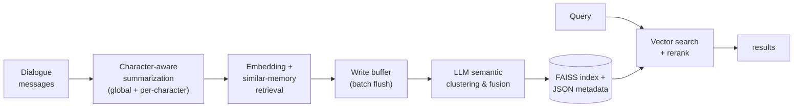

# TeleMem

**Long-term and multimodal memory for agentic AI** — a high-performance, mem0-compatible memory layer built by the Ubiquitous AGI team at TeleAI and Bloo-Mind AI.

[Tech Report (arXiv)](https://arxiv.org/abs/2601.06037) · [GitHub](https://github.com/TeleAI-UAGI/telemem) · [中文文档](https://github.com/TeleAI-UAGI/telemem/blob/main/README-ZH.md)

## Why TeleMem?

- 🎭 **Character memory done right** — the only open-source memory layer that automatically builds **isolated, per-character memory profiles**, built for role-play, companion AI, NPCs, and multi-persona assistants.
- 🎬 **Memory for video, not just text** — a full video → frames → captions → vector DB pipeline with **ReAct-style multi-step video QA**.
- 🏠 **Fully local by default** — runs end-to-end on your hardware (Qwen or Ollama + FAISS); no cloud service, no paid tier, no data leaving your machine.
- 🔌 **mem0-compatible API** — `add()` / `search()` accept the same arguments and return the same `{"results": [...]}` shapes, so existing Mem0 code keeps working with `import telemem as mem0`.

## Results

On the ZH-4O Chinese multi-character long-dialogue benchmark (600-turn conversations, QA accuracy):

| Method | Overall (%) |
|:-------|:------------|
| RAG | 62.45 |
| Mem0 | 70.20 |
| MOOM | 72.60 |
| A-mem | 73.78 |
| Memobase | 76.78 |
| **TeleMem** | **86.33** |

LLM: Qwen3-8B, embeddings: Qwen3-Embedding-8B. Reproduction harness in [`baselines/`](https://github.com/TeleAI-UAGI/telemem/tree/main/baselines).

## How it works



## Install

```shell
pip install "telemem @ git+https://github.com/TeleAI-UAGI/telemem.git"

# extras
pip install "telemem[mcp] @ git+https://github.com/TeleAI-UAGI/telemem.git"    # MCP server
pip install "telemem[video] @ git+https://github.com/TeleAI-UAGI/telemem.git"  # video pipeline
```

Continue with the [Quickstart](quickstart.md).
